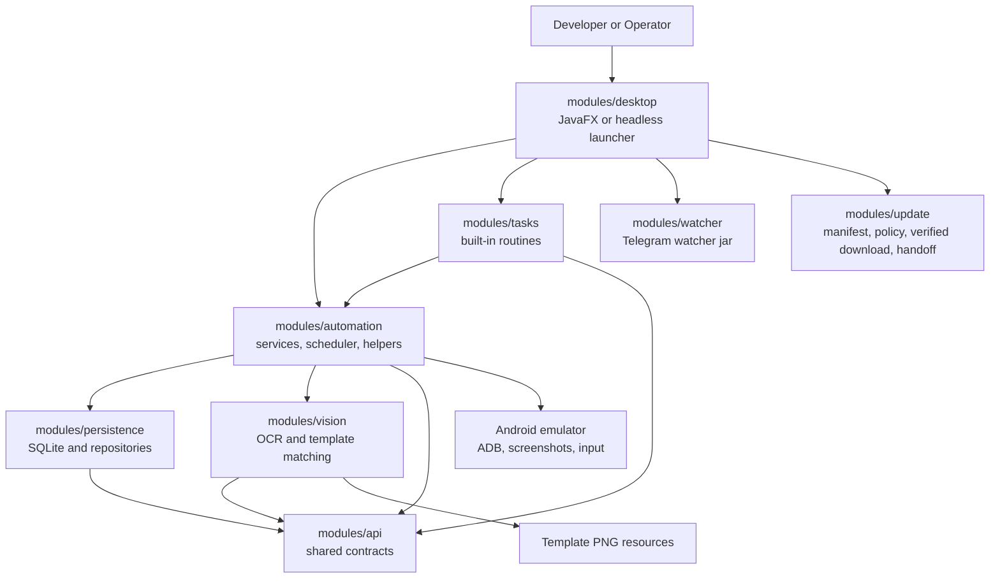
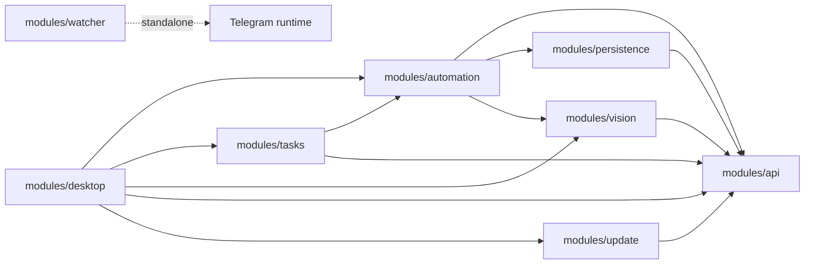
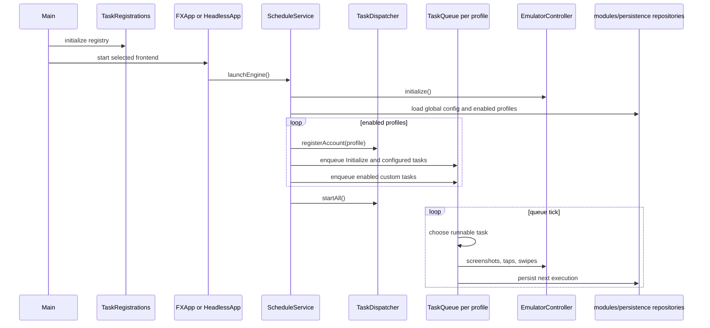
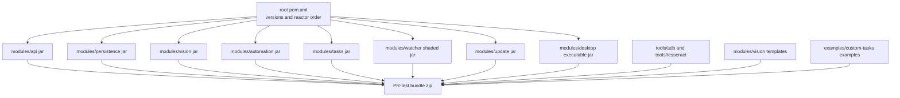

# Frostguard Architecture

This document gives a high-level map of the codebase for developers who need to find the right layer before changing behavior. Frostguard is a Java 21 multi-module Maven application that drives Android emulators for Whiteout Survival automation.

## System Blocks

The main design rule is: UI code configures and observes automation; engine code schedules and coordinates it; task code contains game-specific business behavior; vision/data modules provide lower-level capabilities.

## Dependency Direction

Dependencies should stay mostly downward:

Do not put game task business logic in `modules/desktop`; do not put UI concepts in `modules/automation` or `modules/tasks`.

| Module | Maven artifact | Responsibility |
|---|---|---|
| `modules/api` | `frostguard-api` | Cross-module contracts and domain values |
| `modules/persistence` | `frostguard-persistence` | SQLite, Hibernate, entities, and repositories |
| `modules/vision` | `frostguard-vision` | OCR, OpenCV, templates, and vision assets |
| `modules/automation` | `frostguard-automation` | Emulator control, scheduling, and reusable interactions |
| `modules/tasks` | `frostguard-tasks` | Game-specific automation routines |
| `modules/desktop` | `frostguard-desktop` | JavaFX UI and desktop entry points |
| `modules/watcher` | `frostguard-watcher` | Companion watcher process |
| `modules/update` | `frostguard-update` | Release manifest, version/channel policy, verified download, and installer handoff |
| `packaging/desktop` | `frostguard-desktop-package` | Platform packaging inputs and output verification |

### Update Layer

`modules/update` owns the platform-neutral update trust boundary:

- strict schema-versioned manifest parsing;
- Ed25519 verification of the exact manifest payload against the project public
  key embedded in every eligible build;
- semantic-version, channel, operating-system, and architecture selection;
- restart-safe downloads below the selected workspace cache;
- byte-size and SHA-256 verification;
- optional build-pinned Windows Authenticode verification and token-authorized
  external handoff with passive installer execution and workspace-aware restart.

The desktop module owns presentation and runtime shutdown. Update code does not
depend on JavaFX, persistence, scheduling, or GitHub APIs. Development and
PR-test identities are rejected before manifest discovery.

## Logical Decomposition

### API Layer

`modules/api` contains stable cross-module contracts:

- `TpDailyTaskEnum`, `ConfigurationKeyEnum`, and related enums define task and configuration identifiers.
- `AccountDescriptor`, `TaskStateData`, `DailyTaskStatusData`, `PointData`, `AreaData`, and `ImageSearchResultData` carry state between modules.
- `TemplatesEnum` maps logical template names to classpath resources declared in `modules/api/src/main/resources/config/templates.properties`.

Use this module for shared data shapes only. It should not depend on services, JavaFX, repositories, or emulator code.

### Data Layer

`modules/persistence` owns persistence:

- `DataStore` and `DataSeeder` initialize the SQLite/Hibernate runtime.
- `Profile`, `Config`, `DailyTask`, and related entities model persisted state.
- `ProfileRepository`, `ConfigRepository`, and `DailyTaskRepository` expose repository operations.

Engine services are the normal callers. UI controllers should prefer engine services over direct repository access.

### Vision Layer

`modules/vision` owns low-level image and OCR primitives:

- `OpenCvPatternLocator` loads OpenCV and performs template matching.
- `TesseractOcrProvider` integrates Tess4J/Tesseract.
- `ResilientOcrExecutor` adds retry and validation behavior around OCR extraction.
- PNG templates live under `modules/vision/src/main/resources/templates`.

Task-facing code should usually call `TemplateSearchHelper` or `BotOcrEngine` from `modules/automation`, not raw vision utilities directly.

### Engine Layer

`modules/automation` is the application core:

- `ScheduleService` starts/stops automation, loads profiles/configuration, restores schedules, and publishes bot/queue state.
- `TaskDispatcher` owns per-profile `TaskQueue` instances and starts queue threads.
- `TaskQueue` selects ready tasks, executes them, records task state, handles rescheduling, and manages preemption.
- `DelayedTask` is the base class for all Java automation tasks.
- Helper classes such as `NavigationHelper`, `MarchHelper`, `StaminaHelper`, and `TemplateSearchHelper` provide reusable game operations.
- Services such as `ProfileService`, `ConfigService`, `TaskManagementService`, `LoggingService`, and `StatisticsService` coordinate shared state.
- `EmulatorController` is the gateway for ADB/device actions, screenshots, taps, swipes, process checks, and emulator lifecycle operations.

### Task Layer

`modules/tasks` contains game-specific routines grouped by domain:

- `alliance`, `city`, `combat`, `dailies`, `economy`, `events`, `exploration`, `heroes`, `lifecycle`, `pets`.
- Each routine extends `DelayedTask` and implements `execute()`.
- `TaskRegistrations.initialize()` registers the task factory with `DelayedTaskRegistry`.

To add a built-in task, add the routine in `modules/tasks`, add or reuse a `TpDailyTaskEnum`, then register it in `TaskRegistrations`.

### UI Layer

`modules/desktop` contains the JavaFX screens and application entry points:

- `Main` initializes logging, analytics, task registrations, and launches JavaFX or headless mode.
- `LauncherLayoutController` wires major panels together.
- Panel controllers under `dev.frostguard.app.panel.*` edit configuration and call engine services.
- Scheduler UI controllers call `ScheduleService`, `TaskManagementService`, and `TaskQueue` APIs.
- Task Builder UI creates `AutomationStep` graphs and delegates generation/import/save to `TaskBuilderService`.

FXML and CSS resources live in `modules/desktop/src/main/resources/layout` and `modules/desktop/src/main/resources/styles`.

## Runtime Decomposition

At runtime, one process owns one exclusive workspace, then contains the JavaFX
app or headless bootstrap, shared singleton services, and one task queue per
enabled profile. `WorkspaceSession` creates and locks the workspace before
logging or persistence initializes. All mutable state is resolved through
`WorkspacePaths`; the installation and caller working directory are read-only
runtime inputs.

Installed defaults are `~/.frostguard/workspaces/<channel>/<name>`. Source and
IDE launches detected inside a repository use its ignored `.frostguard-dev/`
workspace. SQLite, logs, custom tasks, diagnostic/cache output, and Telegram
watcher configuration and locking belong to that selected workspace. The
watcher passes the same workspace identity to any bot process it launches.

Each `TaskQueue` chooses runnable tasks by priority and schedule, executes
`DelayedTask.run()`, records state, persists the next execution through
`ScheduleService`, and re-enqueues recurring tasks. Task-facing helpers wrap
emulator control, template matching, and OCR so routines do not depend directly
on low-level providers.

## Task Contract

Built-in and runtime-loaded tasks extend `DelayedTask`. Important hooks:

- `execute()` contains task-specific business logic.
- `getRequiredStartLocation()` tells `NavigationHelper` where the game should be before execution.
- `consumesStamina()`, `provideDailyMissionProgress()`, and `acceptsInjections()` adjust scheduler/helper behavior.
- `getDistinctKey()` differentiates custom tasks or multiple logical tasks with the same enum.
- `reschedule(...)`, `setRecurring(...)`, and `clearSchedule()` control future execution.

Built-in tasks are created through `DelayedTaskRegistry` and
`TaskRegistrations`. Runtime custom tasks are compiled and loaded by
`CustomTaskService`; optional settings use `CustomTaskConfigurable`. Live and
startup scheduling should go through `ScheduleService.scheduleCustomTask(...)`.

## Cross-Cutting Runtime Features

- Preemption: `GlobalMonitorService` registers `PreemptionRule` instances. `TaskQueue` attaches preemption tokens so long-running tasks can be interrupted safely.
- Injection: idle or sleeping tasks can execute `InjectionRule` work, such as alliance help or furnace upgrade checks.
- Navigation: `DelayedTask.run()` validates the game process and delegates screen correction to `NavigationHelper` before `execute()`.
- OCR and image matching: tasks use `BotOcrEngine`, `ResilientOcrExecutor`, and `TemplateSearchHelper`; those wrap `modules/vision`.
- Logging and metrics: task logs flow through `LoggingService`, profile-aware SLF4J logging, `TaskManagementService`, and `StatisticsService`.

## Build and Packaging

The root `pom.xml` controls Java 21, dependency versions, plugin versions, and module order.

`modules/desktop` builds the Java application artifact. It is run from source
with `./mvnw javafx:run`; its versioned JAR is not a standalone distribution.
`packaging/desktop` consumes that artifact and the watcher artifact:

- executable jar: `modules/desktop/target/frostguard-desktop-<version>.jar`
- portable PR-test zip: `packaging/desktop/target/frostguard-<version>-desktop-bundle.zip`
- packaging inputs staged under `packaging/desktop/target/input`
- Windows application images: `packaging/desktop/target/app-image/Frostguard`
  and `app-image/Frostguard Nightly`
- Windows installers: versioned MSI packages under
  `packaging/desktop/target/installers/<channel>`
- ADB/Tesseract files staged from `tools/`
- custom task examples staged from root `examples/custom-tasks/`
- template PNGs staged from `modules/vision/src/main/resources/templates`

The native Windows image contains the desktop and watcher launchers plus a
`jlink` runtime. Each launcher receives its Stable or Nightly channel and
workspace contract through packaged JVM options. The watcher and Task Scheduler launch
the native executables when those packaged launcher paths are present, with
the Java/JAR paths retained only for source and temporary PR-test bundles.
Native packaging is opt-in through Maven profiles so the normal reactor build
stays platform-neutral.

The Nightly MSI product version remains monotonic for Windows Installer. Until
Authenticode signing is enabled, both channels reuse the unchanged, accepted
Nightly bootstrap launcher bytes so Smart App Control reputation stays stable
across Java-only updates. Stable behavior still comes from its separate
packaged JVM configuration; only the PE bootstrap metadata retains the Nightly
product name. The application reports its release version from packaged build
metadata, not from the bootstrap file version. A bootstrap, icon, or JDK change
still requires a new launcher identity and must pass the Windows
signing/reputation gate.

The watcher launcher is channel-specific internal infrastructure and does not
receive Start-menu or desktop shortcuts. The installer exposes only the desktop
launcher, optionally creates its desktop shortcut, and can launch it from the
completion page. Installer maintenance refuses to proceed while that channel's
desktop process is running; its background watcher can be stopped independently
without affecting the other channel.

Stable and Nightly use distinct application IDs, upgrade UUIDs, install
directories, shortcuts, update feeds, workspace paths, and workspace-scoped
Java preferences. A first Nightly launch may copy a closed Stable workspace as
a one-time snapshot before persistence opens. Live sharing, continuous sync,
and automatic Nightly-to-Stable migration are not supported.

The installed desktop exposes update controls only for eligible Stable or
Nightly builds. A selected installer is downloaded to
`<workspace>/cache/updates/<channel>/<version>`, verified, and passed to a
hidden PowerShell waiter. Windows releases publish the MSI package directly;
the jpackage EXE bootstrap wrapper is not part of the update contract. The
waiter requires a one-time authorization token and waits for the Frostguard PID
to disappear before invoking `msiexec` for the same published MSI in passive,
no-restart mode. It pins `INSTALLDIR` to the running
launcher's parent so upgrades retain a user-selected installation directory.
Frostguard authorizes the staged waiter, stops queues and workspace-owned
services, closes SQLite and the workspace lock, and exits. A failed shutdown
cancels the authorization, and the waiter cannot start the installer while the
Frostguard PID is alive. After a successful Windows Installer exit, the waiter
restarts the channel launcher with the same workspace environment. Installer
failure relies on MSI rollback, relaunches the retained application when
possible, and presents the failure instead of reporting success. Manually
downloaded installers remain interactive. Frostguard never replaces its own
running files.

The release feed is a signed envelope whose Ed25519 signature covers the exact
manifest bytes. The embedded project public key is the primary update trust
root. The manifest then binds the immutable installer URL, filename, size, and
SHA-256. Authenticode is an additional check when a release build embeds a
publisher identity; it is not required for project-signed releases.

`modules/watcher` builds a separate shaded watcher jar.

## Where To Change Things

- Add a new task: `modules/api` enum/config if needed, `modules/tasks` routine, `TaskRegistrations`.
- Change scheduling behavior: `ScheduleService`, `TaskDispatcher`, or `TaskQueue`.
- Change a reusable game interaction: `modules/automation/helper`.
- Change OCR/template matching internals: `modules/vision`.
- Add or rename a template: resource under `modules/vision/src/main/resources/templates`, mapping in `templates.properties`, enum in `TemplatesEnum`.
- Change persisted config/profile/task state: `modules/persistence` entities/repositories and engine services.
- Change UI controls or panels: `modules/desktop/src/main/java/dev/frostguard/app/panel/*` plus matching FXML/CSS.
- Change runtime packaging: `packaging/desktop/pom.xml` or its platform sources.
- Change update manifests, selection, download, or trust policy: `modules/update`.
